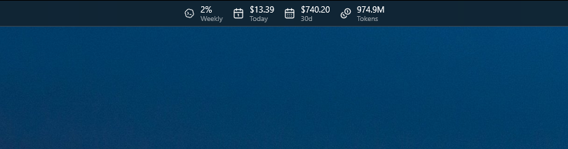
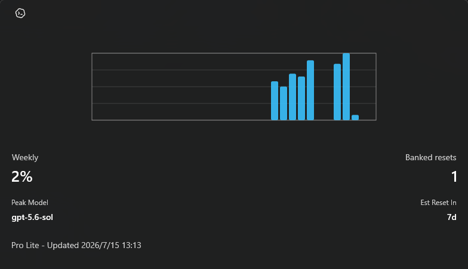
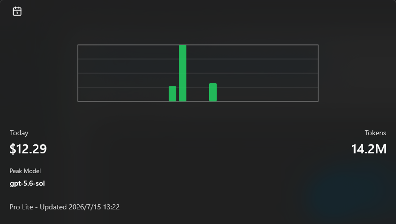
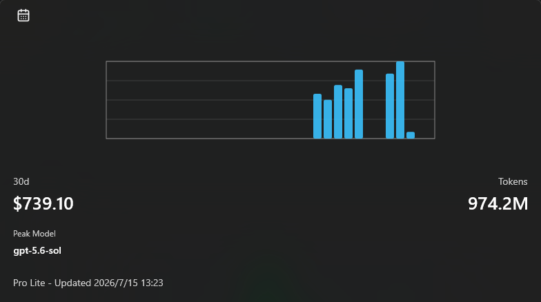
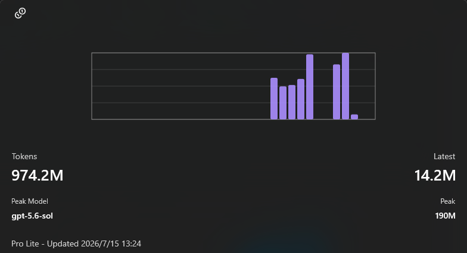

# CodexToys

> [!NOTE]
> The [extension branch](https://github.com/0reki/CodexToys/tree/extension) provides a CodexBar-based extension for [Finesssee/Win-CodexBar](https://github.com/Finesssee/Win-CodexBar).
> It is currently pending an update.

A PowerToys Command Palette extension for checking local Codex usage at a glance.

## Preview

### Dock



### Account And Limits



### Today Usage



### 30-Day Usage



### Token Usage



## Requirements

- Windows with PowerToys Command Palette enabled.
- .NET 9 SDK.
- Windows SDK UAP platform files.

The install script can install missing prerequisites when run with `-InstallMissing`.

## Build And Install

Run:

```powershell
.\scripts\install.ps1
```

## Install A Release Package

Download the Release package for your system architecture and extract it. Open
PowerShell as administrator in the extracted directory, then run:

```powershell
powershell -ExecutionPolicy Bypass -File .\install.ps1
```

## Troubleshooting

- `0x800B0109`: the signing certificate is not trusted. Rerun `scripts\install.ps1`
  from an elevated PowerShell, or import the generated certificate into trusted stores.
- Package installed but Command Palette does not list the extension: restart
  `Microsoft.CmdPal.UI` and reload extensions.
- No usage appears: confirm Codex logs exist under `%USERPROFILE%\.codex\sessions`,
  or add extra session directories in the extension settings.
